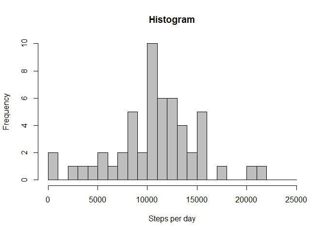
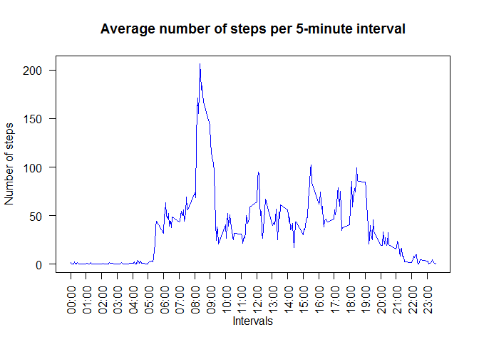
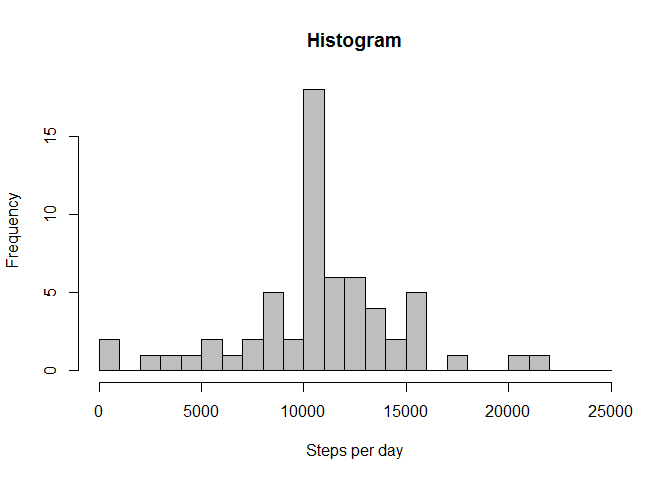
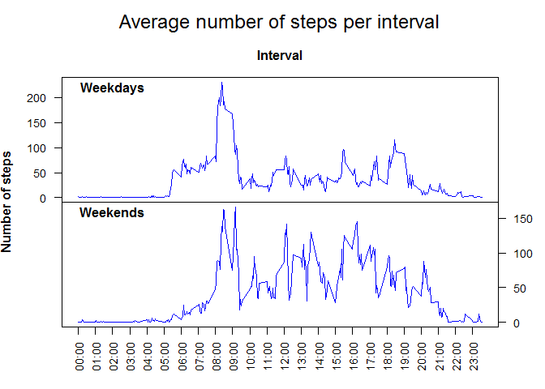

To start off, I would like to mention that it has been quite some time since I last used R (I paused this course for about a year), so it is very likely I have submitted some very inefficient code. I hope this will not impede my grading!

As mentioned on the assignment webpage, the commit should contain the following:

1. Code for reading in the dataset and/or processing the data
2. Histogram of the total number of steps taken each day
3. Mean and median number of steps taken each day
4. Time series plot of the average number of steps taken
5. The 5-minute interval that, on average, contains the maximum number of steps
6. Code to describe and show a strategy for imputing missing data
7. Histogram of the total number of steps taken each day after missing values are imputed
8. Panel plot comparing the average number of steps taken per 5-minute interval across weekdays and weekends
9. All of the R code needed to reproduce the results (numbers, plots, etc.) in the report

This will also be the structure for this R Markdown file

First of all, we are going to load the knitr package and make sure the echo functionality is always enabled

```r
library(knitr)
opts_chunk$set(echo = TRUE)
```

### 1. Code for reading in the dataset and/or processing the data

Now we can load the data, which was downloaded from the assignment page.
In order to do this, I first set the working directory to the directory containing my data.


```r
data <- read.csv("activity.csv", sep = ",", header = TRUE)
```

Let's see what kind of data we are looking at


```r
head(data)
```

```
##   steps       date interval
## 1    NA 2012-10-01        0
## 2    NA 2012-10-01        5
## 3    NA 2012-10-01       10
## 4    NA 2012-10-01       15
## 5    NA 2012-10-01       20
## 6    NA 2012-10-01       25
```

```r
summary(data)
```

```
##      steps                date          interval     
##  Min.   :  0.00   2012-10-01:  288   Min.   :   0.0  
##  1st Qu.:  0.00   2012-10-02:  288   1st Qu.: 588.8  
##  Median :  0.00   2012-10-03:  288   Median :1177.5  
##  Mean   : 37.38   2012-10-04:  288   Mean   :1177.5  
##  3rd Qu.: 12.00   2012-10-05:  288   3rd Qu.:1766.2  
##  Max.   :806.00   2012-10-06:  288   Max.   :2355.0  
##  NA's   :2304     (Other)   :15840
```

```r
days <- nrow(data)/288
```

Note we have 2304 missing values in the 'steps' variable. This issue will be addressed in a later stage,
since for this assignment I will follow the steps as described above.
Moreover from these stats we can derive that we are dealing with 61 days

### 2. Histogram of the total number of steps taken each day

Now we can calculate the total number of steps per day with the `tappply` function, and store the outcome in the variable `steps_per_day` to create the histogram. Initially the histogram was divided in five bins, but this was later changed to 25 bins to get a better idea of the distribution.


```r
steps_per_day <- tapply(data$steps, data$date, FUN=sum)
hist(steps_per_day, breaks=seq(0,25000, 1000), col = "gray", main = "Histogram", xlab = "Steps per day")
```

<!-- -->

A clear peak can be observed in the 10,000-11,000 steps bin

### 3. Mean and median number of steps taken each day

Simply call the `mean()` and `median()` function to calculate the mean and median number of steps taken each day. As instructed, the missing values may be ignored.


```r
mean(steps_per_day, na.rm=TRUE)
```

```
## [1] 10766.19
```

```r
median(steps_per_day, na.rm=TRUE)
```

```
## [1] 10765
```

It is quite striking to see that the average and the median are so close together.

### 4. Time series plot of the average number of steps taken

For this step, we will again use the `tapply` function to calculate the average steps taken per 5-minute interval. Next obtain the unique intervals, transform these to datetime values and extract the hour and minutes. Then custom ticks and labels for the x axis of the plot are created. Lastly, the time series is plotted.


```r
# Calculate the average number of steps per interval, disregarding the NAs
steps_per_interval <- tapply(data$steps, data$interval, FUN=mean, na.rm=TRUE)

# Add zeros to the intervals in order to transform them into time values
intervals <- unique(data$interval)
for (i in seq(length(intervals))) {
    if (nchar(intervals[i]) == 1) {
        intervals[i] <- paste0("000", intervals[i])
    } else if (nchar(intervals[i]) == 2) {
        intervals[i] <- paste0("00", intervals[i])
    } else if (nchar(intervals[i]) == 3) {
        intervals[i] <- paste0("0", intervals[i])
    }
}

# Transform intervals into time values with strptime, then extract only the hour and minutes
intervals_time <- substr(strptime(intervals, format="%H%M"), start = 12, stop = 16)

# Set xticks and xlabels before creating plot
xticks <- seq(0, 2355, 100)

xlabels <- list()
for (i in seq(1, 288, 12)) {
    if (i == 1) {
        xlabels <- intervals_time[i]
    } else {
        xlabels <- c(xlabels, intervals_time[i])
    }
}

# Plot the time series with every full hour on the x axis as ticks
plot(intervals, 
     steps_per_interval, 
     type = "l", 
     col = "blue",
     main = "Average number of steps per 5-minute interval",
     xlab = "Intervals",
     xaxt = "n",
     ylab = "Number of steps",
     yaxt = "n")

axis(1, at = xticks, labels = xlabels, las=2)
axis(2, las=2)
```

<!-- -->

From this plot we can see that on average most steps are taken between 8AM and 9AM

### 5. The 5-minute interval that, on average, contains the maximum number of steps

We can simply obtain the maximum number of steps with R's `max()` function, then lookup the index.


```r
max(steps_per_interval)
```

```
## [1] 206.1698
```

```r
match(max(steps_per_interval), steps_per_interval)
```

```
## [1] 104
```

So knowing the index is 104, we obtain the corresponding interval from the `intervals_time` vector we created.


```r
intervals_time[104]
```

```
## [1] "08:35"
```

Here we see than on average most steps are taken in the 5 minute interval from 08:35 to 08:40

### 6. Code to describe and show a strategy for imputing missing data


```r
nas <- sum(is.na(data$steps))
print(nas)
```

```
## [1] 2304
```

The number of NA values in our dataset equals 2304. We will impute these values by replacing the NA values by the average number of steps for that interval.


```r
# Select unique dates
dates <- unique(data$date)

# Create empty dataframe
newdata <- data.frame()

# First loop over unique dates and create a subset for each date    
for (i in dates) {
    sub <- data[data$date == i, ]
    
    # Check if subset contains NAs. If not, add data to new data frame without manipulations
    if (sum(is.na(sub)) == 0) {
        newdata <- rbind(newdata, sub)
        
    # If subset does contain NAs at intervals, replace value with average number of steps for that interval
    } else {
        for (j in seq(sub$steps)) {
            if (is.na(sub$steps[j])) {
                sub$steps[j] <- steps_per_interval[j]
            }
        } 
        newdata <- rbind(newdata, sub)
    }
}

summary(newdata)
```

```
##      steps                date          interval     
##  Min.   :  0.00   2012-10-01:  288   Min.   :   0.0  
##  1st Qu.:  0.00   2012-10-02:  288   1st Qu.: 588.8  
##  Median :  0.00   2012-10-03:  288   Median :1177.5  
##  Mean   : 37.38   2012-10-04:  288   Mean   :1177.5  
##  3rd Qu.: 27.00   2012-10-05:  288   3rd Qu.:1766.2  
##  Max.   :806.00   2012-10-06:  288   Max.   :2355.0  
##                   (Other)   :15840
```

As the summary shows, all NA values have been replaced

### 7. Histogram of the total number of steps taken each day after missing values are imputed

For this part we can reuse our code from section 2


```r
new_steps_per_day <- tapply(newdata$steps, newdata$date, FUN=sum)
hist(new_steps_per_day, breaks=seq(0,25000, 1000), col = "gray", main = "Histogram", xlab = "Steps per day")
```

<!-- -->

From this histogram we can see that the frequency of days with 10,000-11,000 steps has increased (which makes sense given that all NAs have been substituted by average values)

### 8. Panel plot comparing the average number of steps taken per 5-minute interval across weekdays and weekends

First this part we first have to create a new factor variable which takes values "weekday" or "weekend". Then we can use this variable to calculate the average steps per interval for weekdays and weekends, using the `tapply` function. Then we make a panel plot showing time series plot for both categories.


```r
# First create a new factor variable typeday to make a distiction between weekdays and weekends
newdata$newdate <- strptime(newdata$date, format = "%Y-%m-%d")
newdata$day <- weekdays(newdata$newdate)
newdata$typeday <- ""

for (i in seq(length(newdata$day))) {
    # If day is either a Saturday (=zaterdag) or a Sunday (=zondag), mark as weekend, otherwise as weeday
    if (newdata$day[i] == "zaterdag" || newdata$day[i] == "zondag") {
        newdata$typeday[i] <- "weekend"
    } else {
        newdata$typeday[i] <- "weekday"
    }
}

# Calculate average steps per interval, split between weekdays and weekends
new_steps_per_interval <- tapply(newdata$steps, list(newdata$typeday, newdata$interval), FUN=mean)

# Set number of graphs and margins
par(mfrow=c(2,1), oma = c(1,1,2,0))

# First plot for weekdays
par(mar = c(0, 3,3,3))
plot(intervals, 
     new_steps_per_interval[1, ], 
     type = "l", 
     col = "blue",
     xlab = "",
     xaxt = "n",
     ylab = "",
     yaxt = "n",
     main = "Interval",
     cex.main = 1)
axis(2, las=2, cex.axis = 0.9)
text(x=200,y=220, labels=expression(bold("Weekdays")))

# Second plot for weekends
par(mar = c(3, 3,0,3))
plot(intervals, 
     new_steps_per_interval[2, ], 
     type = "l", 
     col = "blue",
     xlab = "",
     xaxt = "n",
     ylab = "",
     yaxt = "n")

axis(1, at = seq(0, 2355, 100), labels = xlabels, las=2, cex.axis = 0.9)
axis(4, las=2, cex.axis = 0.9)
text(x=200,y=160, labels=expression(bold("Weekends")))

mtext("Average number of steps per interval", outer=TRUE, cex=1.5)
mtext(expression(bold("Number of steps")), side=2, outer=TRUE, cex=1)
```

<!-- -->

From these plots we can see that during weekdays there is a significant peak at around 8:30AM, whereas during weekends the number of steps per interval is more evenly distributed.

### 9. All of the R code needed to reproduce the results (numbers, plots, etc.) in the report

All code has already been presented in previous sections.
